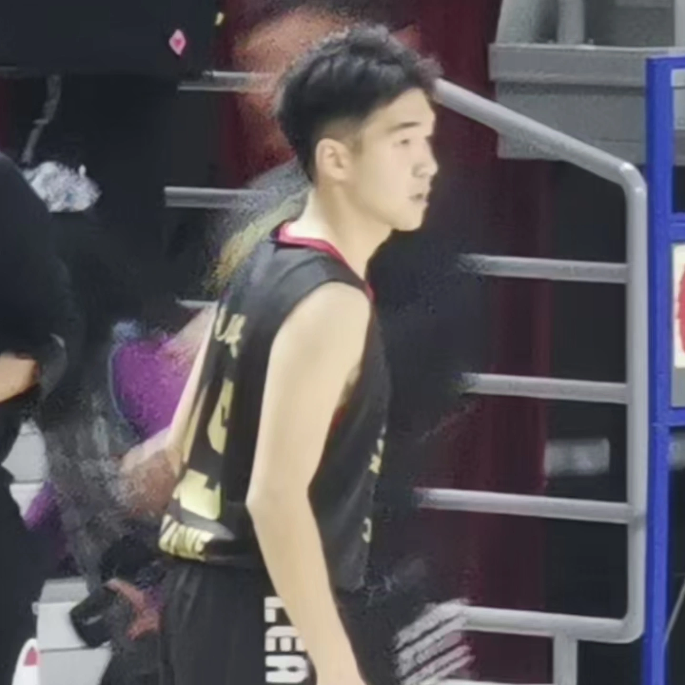


Sports
======
* During my undergraduate years, I was proud to play for the joint men’s basketball team of the School of Mathematical Sciences and the School of Statistics, serving as the captain for two years.

* I also love skiing.

Template
======
* The only contribution I made to the UChicago is slides template... [UChicago Beamer](https://www.overleaf.com/latex/templates/uchicago-beamer/gpcrpvqzvdfr)

<!-- Work experience
======
* 2022-2023: Algorithm engineer
  * Syneron Tech
  * Duties included: AI for drug discovery, phage display & cDNA display NGS analysis -->

  
<!-- Skills
======
* Skill 1
* Skill 2
  * Sub-skill 2.1
  * Sub-skill 2.2
  * Sub-skill 2.3
* Skill 3 -->
<!-- 
Publications
======
  <ul>
    
  </ul> -->
  
<!-- Talks
======
  <ul>
    
  </ul>
  
Teaching
======
  <ul>
    
  </ul>
  
Service and leadership
======
* Currently signed in to 43 different slack teams -->
